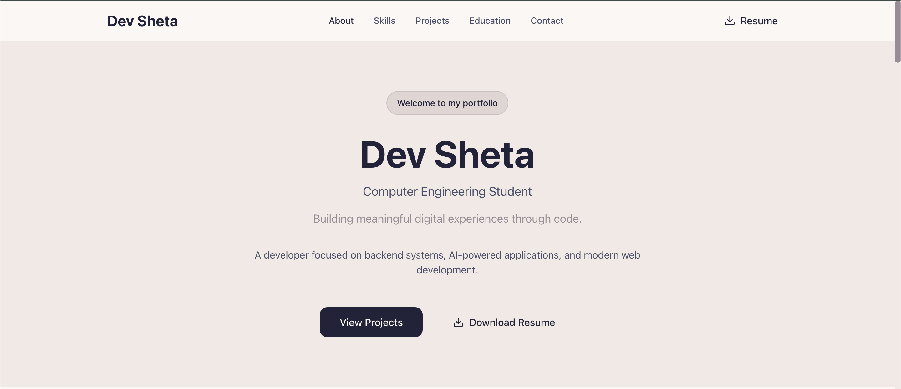
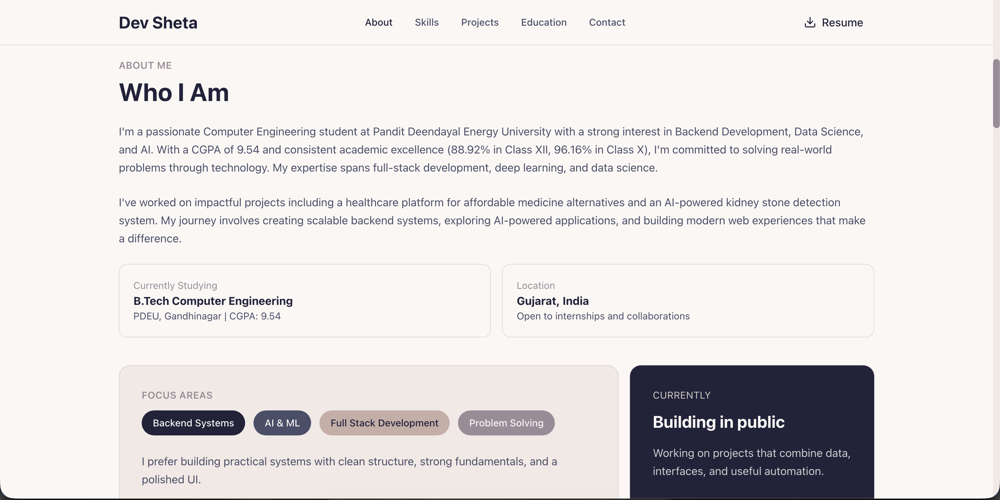
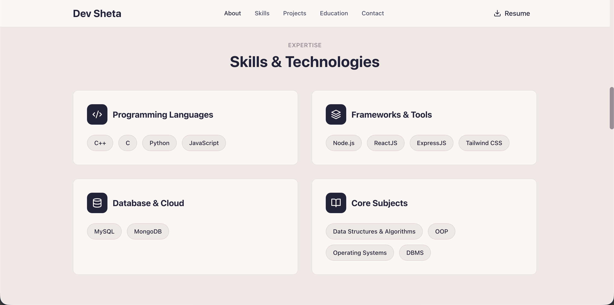
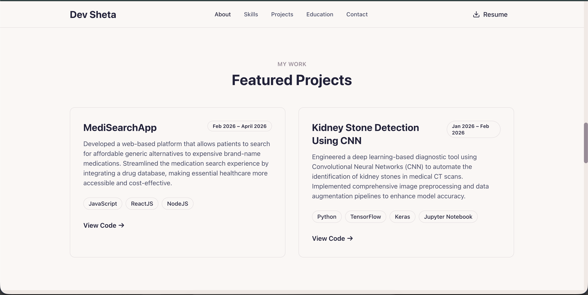
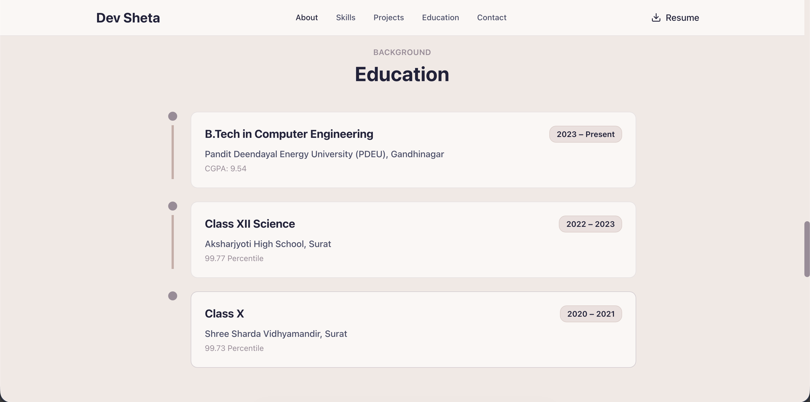
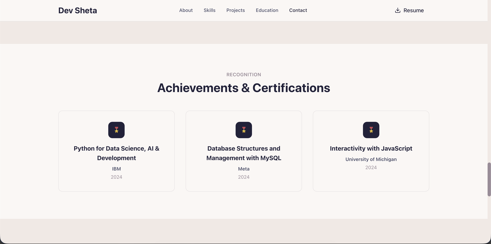
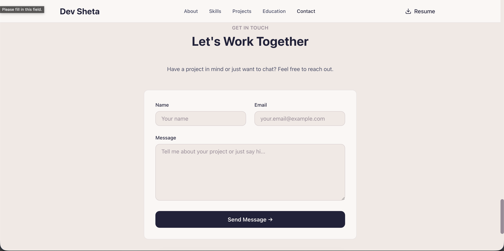

# Dev Sheta Portfolio

  

  Personal Portfolio Website built to showcase projects, technical skills, achievements, and professional growth.

---

## ◈ Tech Stack

  

---

## ◈ Features

• Fully Responsive Design

• Modern UI & Smooth User Experience

• Project Showcase

• Skills & Technologies Section

• Education Timeline

• Certificates & Achievements

• Contact & Social Links

• Fast Performance Optimization

• Vercel Deployment

---

## ◈ Screenshots

### Hero Section

### About Section

### Skills Section

### Projects Section

### Education Section

### Certificates Section

### Contact Section

---

## ◈ Live Website

https://devsheta-portfolio.vercel.app

---

## ◈ Technologies Used

HTML • CSS • JavaScript • React.js • Tailwind CSS • Git • GitHub • Vercel
